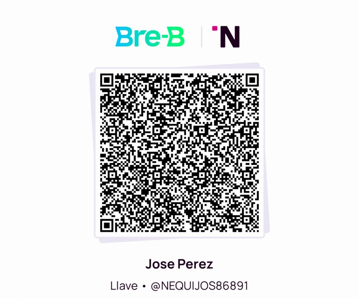

# Crece 🌱

**English** · [Español](README.es.md)

An app to track your kids' growth: weight, height, and progress photos.
It's a **PWA** (installable web app): add it to your iPhone home screen and it
looks and feels like a native app — **no App Store required**.

**All data lives only on your device** (IndexedDB). Nothing is ever sent to a
server.

## Features

- Multiple profiles (one chip per kid, with emoji).
- Weight and height entries with date, note, and optional photo; each entry
  shows the kid's age at that moment and the change since the previous entry.
- Weight and height charts over time, with touch tooltips and a data table.
  Automatic light and dark mode.
- Photo gallery ordered by age.
- Backup: export/import everything (profiles, entries, and photos) as a single
  JSON file you can keep in iCloud or Files.
- Works offline (service worker) when served over HTTPS.

## Try it on your Mac

```sh
cd kids-tracker
python3 -m http.server 8000
```

Open <http://localhost:8000>. To see sample data without creating a profile,
open <http://localhost:8000/#demo> (or `#demo/graficas`, `#demo/fotos`).

## Use it on your iPhone

### Option A — Served from your Mac (same WiFi network)

1. On the Mac: `python3 -m http.server 8000 --bind 0.0.0.0`
2. Find your Mac's IP: `ipconfig getifaddr en0`
3. In Safari on the iPhone open `http://<your-mac-ip>:8000`
4. **Share → Add to Home Screen**.

Data is stored on the iPhone, but since this is `http` (not HTTPS) offline mode
won't work: the app needs the Mac to be serving in order to *load* (your data
is never lost — only the initial load comes from the Mac).

### Option B — GitHub Pages (recommended for daily use)

Push this repo to GitHub and enable Pages. Served over HTTPS, the service
worker registers: the app **works 100% offline** after the first load, and
your data still lives only on the phone (the page is static — there is no
server receiving anything). Then in Safari:
**Share → Add to Home Screen**.

## Tips

- Make a **backup** (Settings → Export) every so often: iOS may evict data for
  websites that go unvisited for a long time. The app requests persistent
  storage, but the backup file is your safety net.
- Photos are resized to max 1280 px and compressed to JPEG so they don't fill
  up your phone.

## ☕ Support

This app is free and ad-free. If it helps you, you can leave a voluntary tip by
scanning this QR with your payments app (Bre-B / Nequi), or using the key
`@NEQUIJOS86891`:



## Structure

| File | What it is |
|---|---|
| `index.html` | App structure (views, dialogs) |
| `styles.css` | Styles, light/dark color tokens |
| `app.js` | Logic: IndexedDB, entries, SVG charts, backup |
| `sw.js` | Service worker (cache for offline use) |
| `manifest.webmanifest` | PWA manifest (name, icons, standalone) |
| `icons/` | App icons |
